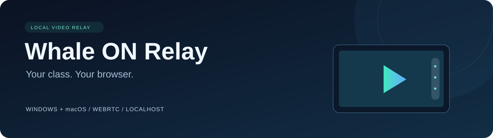

<div align="center">



[한국어](README.md) · **English**

**Watch Whale ON and Google Meet in your own workspace.**

Zoom · Screenshots · Recording · Windows / macOS

[Get started](#get-started) · [Google Meet](#google-meet) · [Whale ON](#whale-on) · [Technical guide](docs/technical.en.md)

</div>

> **Google Meet support is experimental.** Synthetic relay tests passed; live Meet audio/video verification is pending.

## Get started

Install **Python 3.9+** and **Chrome**. Install **Whale** too if you use Whale ON.

```sh
git clone https://github.com/snowflake-rider/meeting-relay.git
cd meeting-relay
```

Already have the project? Run the commands from the project folder. The server and receiving browser must be on the **same computer**.

**Recommended workspace:** [Install Wave Terminal](https://www.waveterm.dev/download), add a **Web widget** beside your terminal, and paste the player URL. Use Chrome if video or downloads do not work in Wave. On macOS, `brew install --cask wave` is also available. Wave compatibility has not yet been verified.

## Google Meet

**1. Start the server** from the project folder.

Windows PowerShell:

```powershell
.\cls-whale.ps1 --source meet --no-open --port 18747
```

macOS:

```sh
python3 launch.py --source meet --no-open --port 18747
```

**2. Choose a tab.** Join your Meet call in Chrome and open the [capture page](http://127.0.0.1:18747/capture). Click start yourself, choose the **Meet tab**, and enable **tab audio sharing**.

**3. Watch.** Paste this address into Chrome or Wave:

```text
http://127.0.0.1:18747/?source=meet
```

Meet works **without installing the extension**. Keep the meeting and capture tabs open. The meeting UI is included; your own microphone is not recorded.

## Whale ON

**1. Install the extension.** In Whale, open `whale://extensions` → **Developer mode** → **Load unpacked** → select this project's **`extension` folder**.

**2. Join your class.** Click the extension icon, enter your invitation link, then **Save link → Open class**. Rejoin meetings that were open before installing the extension.

**3. Start the server** from the project folder:

```powershell
# Windows PowerShell
.\cls-whale.ps1 --no-open
```

```sh
# macOS
python3 launch.py --no-open
```

**4. Watch.** Open the [Whale player](http://127.0.0.1:18745/). Keep the Whale meeting open while watching.

## Player controls

| Feature | Control |
| --- | --- |
| Connection | Green **LIVE** / red **OFF** |
| Play / pause | `Space` |
| Zoom / pan | `+` / `−`, wheel/pinch, drag / `0` to reset |
| Screenshot | Camera button or `S` |
| Record / save | ● or `R` → press again to save / ↓ to download again |
| Sound | Speaker button — muted by default |
| Full screen | `F` |

**Recordings stream directly to disk as WebM.** In the extension's recording settings or the player's **⚙**, enable **automatic MP4 conversion after recording**. Settings apply to the next recording.

- WebM needs no extra installation. MP4 conversion requires **FFmpeg**.
- WebM originals are retained, including on conversion failure. Use the ⚙ file list to retry conversion or download.
- Files default to this project's `.runtime/recordings`. Preserve your recordings before deleting the project folder.
- Stop recording before closing the tab. Playback mute and pause do not mute or pause the recording.

For isolated testing, change the Meet command above to port **18749** and set the extension's **Local server port** to match. Settings: `http://127.0.0.1:18749/recording-settings`.

## Learn more

**[Technical guide →](docs/technical.en.md)** Architecture, ports, verification status, the `cls-whale` shortcut, optional Meet extension setup, recording details, manual relay, troubleshooting, and development tests.

Extension updates: reload the extension and rejoin the Whale meeting. Local server port saves on change and before copying an address or opening capture; the sender follows the saved port.
