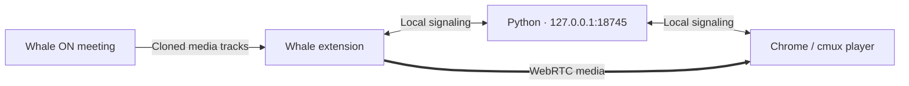

<div align="center">


<br>

[한국어](README.md) · **English**

**Watch your Whale ON class in a browser tab that fits your workspace.**

A local WebRTC relay with a full-window player, floating controls, and one-command startup.


[Wave Terminal](#recommended-workspace-wave-terminal) · [Quick start](#quick-start) · [Player controls](#player-controls) · [How it works](#how-it-works) · [Troubleshooting](#troubleshooting)

</div>

---

## Google Meet support · feature branch

This worktree is **`feature/google-meet`**. The verified Whale version remains on `main`. Meet support relays a **user-selected browser tab**, including its meeting UI, rather than relying on Meet's internal video elements.

### Run beside the stable Whale server

Keep Whale on **18745** and use **18747** for this worktree.

```powershell
# Windows PowerShell, inside this worktree
.\cls-whale.ps1 --source meet --no-open --port 18747
```

```sh
# macOS, inside this worktree
python3 launch.py --source meet --no-open --port 18747
```

1. Join Google Meet in **Chrome**.
2. Open **http://127.0.0.1:18747/capture** in that same Chrome browser.
3. Click start yourself, select **Chrome tab → your Meet tab**, and enable **tab audio sharing**.
4. Open **http://127.0.0.1:18747/?source=meet** in the receiving Chrome/Wave/cmux window.
5. Keep the capture page and meeting tab open. Stopping the relay does not leave the meeting.

The capture page works without the extension. Start capture in **Chrome where Meet is open**, not in the receiving Wave window. No microphone permission is requested; your own microphone is not recorded. Only audio output from the selected tab is captured. Missing audio is explicitly reported.

### Optional extension workflow

Load this worktree's `extension` folder as a separate development extension: **Whale + Meet Local Relay 0.4.0**. Save your Meet link and use **Open class**. Set **Local server port** to `18747`, then select **Google Meet · 탭 중계 열기**. For a default-port deployment, match the popup/server to `18745`. The configurable port affects the popup/Meet path; Whale's automatic content script keeps its existing port 18745.

### Verification boundaries

- All 26 automated tests pass, including Whale regressions and Meet/Whale signaling isolation.
- `tests/meet-loopback.html` verified real WebRTC forwarding of a synthetic 640 × 360 video in Chrome, including decoded frames and preservation of the original track after stopping.
- Tests cover invalid URLs/ports, cancelled sharing, window/screen rejection, missing audio, receiver isolation, and track cleanup.
- Chrome requires a real user gesture and a fresh sharing selection. Capture is never selected automatically. [Screen capture API documentation](https://developer.mozilla.org/en-US/docs/Web/API/MediaDevices/getDisplayMedia)
- Live Meet audio/video, Windows, and Wave playback still require verification. The existing recording limit of approximately 256 MiB remains.

## A little more room for your class

Keep Whale connected to your meeting. Watch the relayed video in **Chrome**, or in a **cmux browser tab on macOS**, with no persistent header or footer taking up space.

| | What you get |
| :--- | :--- |
| **An uncluttered player** | Full-window video with a floating toolbar on the right. |
| **A closer look** | Zoom from 1× to 8×, drag to pan, and reset to fit. |
| **A moment to read** | Pause your local playback; resume to return to the live stream. |
| **A local recording** | Record received video and mixed audio; stop to download a WebM file (MP4 fallback where supported). |
| **A frame to keep** | Save a PNG at the source video's resolution, without player controls. |
| **One command** | Start or reuse the local server, open Whale, and print the player URL. |
| **A local connection** | Python serves the player and signaling on `127.0.0.1`. No hosted relay service. |

> **Experimental:** manual relay playback was verified at 1920 × 1080 in Chrome and cmux on macOS. Automatic extension injection into a live Whale ON meeting still needs verification. Windows launch support is implemented; live Windows video playback is not yet verified.

## Recommended workspace: Wave Terminal

For a terminal-and-video workspace, we recommend **[Wave Terminal](https://www.waveterm.dev/)**. It puts a terminal and a web widget side by side on Windows and macOS. This is a workflow recommendation; relay playback and recording inside Wave have not yet been verified.

1. Install Wave from the **[official download page](https://www.waveterm.dev/download)**. On Windows choose the Windows installer; on macOS choose the matching Apple Silicon or Intel build, or run `brew install --cask wave`.
2. Open a local PowerShell terminal (Windows) or zsh terminal (macOS) in Wave and run the launcher below. Use a local terminal, not an SSH/WSL shell: the player and server must be on the same machine.
3. Add a **Web** widget and enter `http://127.0.0.1:18745/`. Arrange it beside your terminal. See [Wave's web widget documentation](https://docs.waveterm.dev/customwidgets).
4. If video or downloads do not work in the embedded widget, open the same address in Chrome. Chrome is the initial recording target; Wave is optional.

## Quick start

You need **Whale**, **Python 3.9+**, and a receiving browser on the **same computer**. Keep Whale open while watching. There are no Python packages to install.

### 1 · Get the project

```sh
git clone https://github.com/snowflake-rider/whale-on-relay.git
cd whale-on-relay
```

Or use **Code → Download ZIP**, then extract the archive.

### 2 · Install the Whale extension

1. Open `whale://extensions` in Whale.
2. Enable **Developer mode**.
3. Select **Load unpacked**.
4. Choose this project's **`extension`** folder, which contains `manifest.json`.
5. Confirm **Whale Local Relay** is enabled. Reopen a meeting that was already running when you installed the extension.

### 3 · Set your class link in the extension

Click **Whale Local Relay** in Whale's extensions menu (pin it for easy access). Paste your invitation link, select **Save link**, then **Open class**. The link stays in this browser's local extension storage; it is not bundled with the project or synced to your account.

### 4 · Start the local server

**Windows · PowerShell**

```powershell
.\cls-whale.ps1 --no-open
```

**macOS · Terminal**

```sh
python3 launch.py --no-open
```

Join the meeting in Whale, then paste the printed address into your receiving browser. The extension also has a **Copy player address** button.

```text
http://127.0.0.1:18745/
```

**A healthy server is not proof of a connected video stream.** The extension must be running in the actual meeting window; look for its small relay indicator. The receiving browser is not opened automatically. The extension saves and opens your class link; the local Python server still needs the command above.

Prefer opening the class from the terminal too? Pass `--meeting 'https://whaleon.us/o/YOUR-LINK'` instead of `--no-open`, or use the optional shortcut below. The CLI and the extension keep their settings separately.

<details>
<summary><strong>Make it a daily one-command shortcut</strong></summary>

#### Windows PowerShell

Open your PowerShell profile with `notepad $PROFILE`. If it does not exist, create it first:

```powershell
New-Item -ItemType Directory -Force (Split-Path $PROFILE)
New-Item -ItemType File $PROFILE
```

Add this function, using your actual project path and meeting link:

```powershell
function cls-whale {
    $env:WHALE_MEETING_URL = 'https://whaleon.us/o/YOUR-LINK'
    & 'C:\Projects\whale-on-relay\cls-whale.ps1' @args
}
```

Save, run `. $PROFILE`, then use:

```powershell
cls-whale
cls-whale | Set-Clipboard
```

#### macOS zsh

Add this function to `~/.zshrc`, replacing the path and link:

```zsh
cls-whale() {
  WHALE_MEETING_URL='https://whaleon.us/o/YOUR-LINK' \
    python3 "$HOME/Projects/whale-on-relay/launch.py" "$@"
}
```

Save, run `source ~/.zshrc`, then use:

```zsh
cls-whale
cls-whale | pbcopy
```

The server runs in the background. Run the command again after restarting your computer.

</details>

<details>
<summary><strong>Options, custom Whale location, and login startup</strong></summary>

| Option | Behavior |
| :--- | :--- |
| `--meeting URL` | Open this invitation link in Whale. Overrides `WHALE_MEETING_URL`. |
| `--no-open` | Prepare the server and print the address without opening Whale. No meeting URL required. |
| `--check` | Check an existing server and print its address. Start nothing. |

Already in your meeting? Use `--no-open`.

On Windows, the launcher searches PATH and common per-user/system Whale installation folders. For a custom installation:

```powershell
$env:WHALE_PATH = 'D:\Apps\Whale\Application\whale.exe'
.\cls-whale.ps1 --meeting 'https://whaleon.us/o/YOUR-LINK'
```

**Optional macOS login startup:** run `python3 setup_auto.py install` or double-click `setup.command`. To remove it, run `python3 setup_auto.py uninstall` or double-click `stop-auto.command`. Reinstall after moving the project. Windows login startup is not provided.

</details>

## Player controls

| Control | Shortcut / gesture |
| :--- | :--- |
| Connection | Green LIVE: video connected / red OFF: waiting or disconnected |
| Play / pause | `Space` |
| Zoom in / out | `+` / `−`, wheel, or pinch |
| Move a zoomed image | Drag |
| Fit to window | `0` or the scale button |
| Save screenshot | Camera icon or `S` |
| Start / stop recording | `R` or ● / ■ |
| Save last recording again | ↓, shown after recording ends |
| Full screen | `F` |
| Sound | Speaker: on / slashed speaker: off — muted by default |
| Stop / reconnect | ■ |

Pausing freezes your local view. Resuming returns to live video; there is no DVR or rewind. Enable sound in either Whale or the player to avoid hearing both.

## Recording

Start the stream, then press **●** in the right toolbar or **R**. A red indicator and elapsed time stay visible while recording. Press it again to finish and request a download. The **↓** link lets you save the last recording again if the automatic download is blocked.

- Records the incoming image at its source dimensions, excluding zoom/pan and player controls.
- Mixes audio tracks present when recording starts. Player mute and playback pause do **not** mute or pause the recording. No microphone or screen capture permission is requested.
- Chooses a format with `MediaRecorder.isTypeSupported()`: WebM first, then MP4 where supported. Windows Chrome uses browser recording APIs; no FFmpeg installation is required. See [MediaRecorder documentation](https://developer.mozilla.org/en-US/docs/Web/API/MediaRecorder).
- Buffers data in memory and automatically stops around **256 MiB** (checked at each chunk), then offers the file. Start another recording for the next segment. This is not an unlimited-duration recorder.
- Finalizes the current clip if video/audio tracks disappear or change. Reconnect and start a new clip to continue.
- **Stop and save before closing/reloading the tab.** The browser is asked to warn while recording, but a crash or forced close can lose unsaved data. The last-file link remains until the next completed recording or page close.

Actual Windows/Wave recording, audio playback, and download behavior still need device verification. Logic tests cover format rejection, audio mixing, final chunks, source changes, memory threshold, and protecting original tracks.

## How it works



The extension runs on `one.whaleon.naver.com`. It clones the meeting's existing media tracks and connects them to the receiver through WebRTC. Python serves the player and exchanges connection messages; it does not record the video. No external ICE servers are configured.

This is a relay of an **active Whale meeting**, not a standalone HLS URL or a replacement for joining the meeting in Whale. The content script runs only on the configured Whale ON site. The popup uses the `storage` permission to remember your class link locally. This is an independent project, not an official NAVER product.

## Troubleshooting

| Symptom | Try this |
| :--- | :--- |
| PowerShell blocks the script | Run `py -3 .\launch.py --meeting 'https://whaleon.us/o/YOUR-LINK'` directly. If `py` is unavailable, use `python`. |
| Python is missing | Install Python 3.9+ and reopen your terminal. Check `py -3 --version` or `python3 --version`. |
| Whale cannot be found on Windows | Set `WHALE_PATH` as shown above, or use `--no-open` and open the meeting yourself. |
| No relay indicator | Check that the extension is enabled and rejoin the meeting. If injection fails, use the manual fallback below. |
| Waiting for shared video | The presenter must start video or screen sharing. |
| Cannot connect to the local server | Rerun the launcher. Check [server health](http://127.0.0.1:18745/health); startup logs are in `.runtime/launcher-server.log`. |
| Port already in use | Identify the service using port 18745. The launcher rejects an unrelated service instead of terminating it. |

For personal Windows machines, `Set-ExecutionPolicy -Scope CurrentUser RemoteSigned` permits local scripts and profiles. Downloaded scripts may also need `Unblock-File .\cls-whale.ps1` after you review them. Follow your organization's policy on managed machines. See [Microsoft's execution policy guide](https://learn.microsoft.com/en-us/powershell/module/microsoft.powershell.core/about/about_execution_policies).

<details>
<summary><strong>Manual fallback — when the extension cannot reach the meeting window</strong></summary>

1. Start the manual server and keep its terminal open:
   - Windows: `py -3 .\relay_server.py`
   - macOS: `python3 relay_server.py`, or double-click `start.command`.
2. Copy all of `sender.js`.
3. Open developer tools in the **actual Whale meeting window**: `Ctrl+Shift+I` on Windows or `⌘⌥I` on macOS. Run the code in **Console**.
4. When `LOCAL_RELAY_READY` appears, open `http://127.0.0.1:18744/` in the receiving browser.

Manual relay uses **18744**; extension relay uses **18745**. Use one receiving tab for the manual relay. To reconnect: close that tab, rerun `sender.js`, then reopen the player. Stop the manual server with `Ctrl+C`.

</details>

## Development & verification

```sh
python3 -m unittest discover -s tests -p 'test_*.py'
node --test tests/extension.test.cjs tests/popup.test.cjs tests/recording.test.cjs tests/capture.test.cjs
```

On Windows, replace `python3` with `py -3`. Node.js is needed only for the extension tests. After editing `recording.js`, `player-ui.js`, or `player-ui.css`, run `python3 build_player_ui.py` to update both player HTML files.

| Area | Verification boundary |
| :--- | :--- |
| Manual relay | Chrome and cmux 1080p playback verified on macOS. |
| Player controls | Synthetic-video zoom, pan, pause/resume, and 1080p PNG export verified. |
| Launcher | Unit tests cover path discovery, detached-process flags, server reuse, URL-only output, and macOS launch behavior. |
| Extension | Mock tests cover track cloning, receiver isolation, and stopping without ending original meeting tracks. |
| Recording | macOS Chrome synthetic capture produced a 640 × 360 VP8 + Opus WebM, verified with a media file probe. Recording logic tests cover cleanup and failure boundaries. |
| Still to verify | Live extension injection/reconnection, live Windows playback, Windows terminal-close behavior, macOS login startup, physical pinch gestures, and cmux screenshot downloads. |

Use one Whale meeting at a time. The project has no bundled meeting link. Save your own link in the extension, or use local shell configuration for the optional CLI shortcut.
