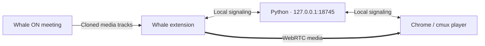

# Technical guide · Meeting Relay

[Back to quick start](../README.en.md) · [한국어](technical.md)

## Sources and ports

| Path | Source | Typical player address |
| --- | --- | --- |
| Whale extension | Cloned meeting media tracks | `http://127.0.0.1:18745/` |
| Google Meet | User-selected Chrome tab capture | `http://127.0.0.1:18747/?source=meet` |
| Whale manual relay | `sender.js` in the meeting Console | `http://127.0.0.1:18744/` |

Meet uses 18747 in the quick start so it can coexist with the stable Whale server. Match the server's `--port` and the popup's **Local server port** to use another port. Whale's sender follows the saved port too; its default is 18745. Click Save link and open the receiving player at the same port.

`main` includes Whale relay, experimental Google Meet support, and optional MP4 conversion. The server isolates Whale and Meet signaling channels. Use only one sending page per service at a time.

Meet capture starts with `getDisplayMedia()`. A direct user gesture and a fresh sharing selection are required. Window/full-screen sources are rejected. The app cannot automatically verify that the chosen browser tab's URL belongs to Meet. Meeting UI is included; the user's microphone is not captured. Missing tab audio is explicitly reported. [Screen capture API](https://developer.mozilla.org/en-US/docs/Web/API/MediaDevices/getDisplayMedia)

### Optional Meet extension workflow

Load this branch's `extension` folder in Chrome using **Load unpacked** to install **Whale + Meet Local Relay 0.5.1**. Save the Meet URL, use **Open class**, set **Local server port** to `18747`, then select **Google Meet · 탭 중계 열기**. The extension does not start the Python server.

### Meet verification

All 26 automated tests passed, including Whale regressions, channel isolation, URL/port handling, cancelled sharing, missing audio, receiver isolation, and cleanup. Chrome's `tests/meet-loopback.html` verified real WebRTC forwarding of a synthetic 640 × 360 video and original-track preservation after stopping. Live Meet audio/video and Windows/Wave compatibility still need verification.

## Launcher configuration

<details>
<summary><strong>Make it a daily one-command shortcut</strong></summary>

#### Windows PowerShell

Open your PowerShell profile with `notepad $PROFILE`. If it does not exist, create it first:

```powershell
New-Item -ItemType Directory -Force (Split-Path $PROFILE)
New-Item -ItemType File $PROFILE
```

Add this function, using your actual project path and meeting link:

```powershell
function cls-whale {
    $env:WHALE_MEETING_URL = 'https://whaleon.us/o/YOUR-LINK'
    & 'C:\Projects\meeting-relay\cls-whale.ps1' @args
}
```

Save, run `. $PROFILE`, then use:

```powershell
cls-whale
cls-whale | Set-Clipboard
```

#### macOS zsh

Add this function to `~/.zshrc`, replacing the path and link:

```zsh
cls-whale() {
  WHALE_MEETING_URL='https://whaleon.us/o/YOUR-LINK' \
    python3 "$HOME/Projects/meeting-relay/launch.py" "$@"
}
```

Save, run `source ~/.zshrc`, then use:

```zsh
cls-whale
cls-whale | pbcopy
```

The server runs in the background. Run the command again after restarting your computer.

</details>

<details>
<summary><strong>Options, custom Whale location, and login startup</strong></summary>

| Option | Behavior |
| :--- | :--- |
| `--meeting URL` | Open this invitation link in Whale. Overrides `WHALE_MEETING_URL`. |
| `--no-open` | Prepare the server and print the address without opening Whale. No meeting URL required. |
| `--check` | Check an existing server and print its address. Start nothing. |

Already in your meeting? Use `--no-open`.

On Windows, the launcher searches PATH and common per-user/system Whale installation folders. For a custom installation:

```powershell
$env:WHALE_PATH = 'D:\Apps\Whale\Application\whale.exe'
.\cls-whale.ps1 --meeting 'https://whaleon.us/o/YOUR-LINK'
```

**Optional macOS login startup:** run `python3 setup_auto.py install` or double-click `setup.command`. To remove it, run `python3 setup_auto.py uninstall` or double-click `stop-auto.command`. Reinstall after moving the project. Windows login startup is not provided.

</details>

## Recording · disk storage and optional MP4

WebM is the default. The embedded extension settings and player ⚙ share `/recording/settings` on the local server. Browsers connected to the same port use the same settings. Settings are read on page load and **snapshotted when recording begins**.

1. The browser encodes video and mixed audio into WebM chunks.
2. Chunks upload sequentially in pieces of at most 4 MiB. Acknowledged data is released from memory.
3. The server appends to a `.part` file. Identical sequence retries do not duplicate bytes.
4. After the final chunk, the server finalizes the WebM.
5. If selected, FFmpeg converts to H.264/AAC MP4 and decodes the entire result before publishing it.

The 256 MiB total-file cap is removed. A **pending browser upload queue over approximately 32 MiB stops recording and drains remaining chunks**. This does not strictly cap the browser's own chunk sizes or internal buffers. Low disk space rejects further writes. Actual 16GB+ or long-duration recording has not yet been verified.

### Files and recovery

The default directory is `.runtime/recordings/<recording ID>/`; the manual server uses `.runtime/recordings-manual/`. Set `RELAY_RECORDINGS_DIR` before server startup to choose another directory. Do not run multiple server processes against the same recording directory.

- `source.webm.part`: active or interrupted input
- `source.webm`: finalized original
- `recording.mp4`: converted and checked output
- `metadata.json`, `conversion.log`: state and conversion errors

**WebM is retained even after successful conversion**, so budget space for both files. The library survives server restarts; unfinished sessions are marked `interrupted`. Partial files are not guaranteed playable and last-chunk recovery after a forced close is not guaranteed. Files use the recording directory, not the system temp directory.

### FFmpeg

On macOS with Homebrew: `brew install ffmpeg`. On Windows, select a Windows build from the [official FFmpeg download guide](https://ffmpeg.org/download.html), add `ffmpeg.exe` to PATH, then restart the server. Check with `ffmpeg -version`. Conversion requires `libx264` and an AAC encoder.

Missing FFmpeg is reported when saving MP4 settings; WebM remains usable. Conversions run one at a time. Failures retain the original and can be retried from the file library's **MP4 conversion** button. The settings page also shows the directory for direct file access.

### Security and verification

The recording API restricts Host to loopback and requests to the same origin. Mutations require a random server token; file paths derive only from server-generated IDs. The extension embeds a localhost settings frame without adding host permissions. This is not an authentication boundary against other local users or processes.

Synthetic browser recordings passed WebM/MP4 disk-save and download checks. Real FFmpeg tests verify H.264/AAC output. Automated tests cover ordering, retries, settings snapshots, failures, restart recovery, and original preservation. Live Windows recording, the installed-extension iframe, long recordings, and forced-close recovery need further validation.

## How it works



The extension runs on `one.whaleon.naver.com`. It clones the meeting's existing media tracks and connects them to the receiver through WebRTC. Python serves the player and exchanges connection messages; it does not record the video. No external ICE servers are configured.

This is a relay of an **active Whale meeting**, not a standalone HLS URL or a replacement for joining the meeting in Whale. The content script runs only on the configured Whale ON site. The popup uses the `storage` permission to remember your class link locally. This is an independent project, not an official NAVER product.

## Troubleshooting

| Symptom | Try this |
| :--- | :--- |
| PowerShell blocks the script | Run `py -3 .\launch.py --meeting 'https://whaleon.us/o/YOUR-LINK'` directly. If `py` is unavailable, use `python`. |
| Python is missing | Install Python 3.9+ and reopen your terminal. Check `py -3 --version` or `python3 --version`. |
| Whale cannot be found on Windows | Set `WHALE_PATH` as shown above, or use `--no-open` and open the meeting yourself. |
| No relay indicator | Check that the extension is enabled and rejoin the meeting. If injection fails, use the manual fallback below. |
| Waiting for shared video | The presenter must start video or screen sharing. |
| Cannot connect to the local server | Rerun the launcher. Check [server health](http://127.0.0.1:18745/health); startup logs are in `.runtime/launcher-server.log`. |
| Port already in use | Identify the service using port 18745. The launcher rejects an unrelated service instead of terminating it. |

For personal Windows machines, `Set-ExecutionPolicy -Scope CurrentUser RemoteSigned` permits local scripts and profiles. Downloaded scripts may also need `Unblock-File .\cls-whale.ps1` after you review them. Follow your organization's policy on managed machines. See [Microsoft's execution policy guide](https://learn.microsoft.com/en-us/powershell/module/microsoft.powershell.core/about/about_execution_policies).

<details>
<summary><strong>Manual fallback — when the extension cannot reach the meeting window</strong></summary>

1. Start the manual server and keep its terminal open:
   - Windows: `py -3 .\relay_server.py`
   - macOS: `python3 relay_server.py`, or double-click `start.command`.
2. Copy all of `sender.js`.
3. Open developer tools in the **actual Whale meeting window**: `Ctrl+Shift+I` on Windows or `⌘⌥I` on macOS. Run the code in **Console**.
4. When `LOCAL_RELAY_READY` appears, open `http://127.0.0.1:18744/` in the receiving browser.

Manual relay uses **18744**; extension relay uses **18745**. Use one receiving tab for the manual relay. To reconnect: close that tab, rerun `sender.js`, then reopen the player. Stop the manual server with `Ctrl+C`.

</details>

## Development & verification

```sh
python3 -m unittest discover -s tests -p 'test_*.py'
node --test tests/extension.test.cjs tests/popup.test.cjs tests/recording.test.cjs tests/recording-upload.test.cjs tests/capture.test.cjs
```

On Windows, replace `python3` with `py -3`. Node.js is needed only for the extension tests. After editing `recording.js`, `player-ui.js`, or `player-ui.css`, run `python3 build_player_ui.py` to update both player HTML files.

| Area | Verification boundary |
| :--- | :--- |
| Manual relay | Chrome and cmux 1080p playback verified on macOS. |
| Player controls | Synthetic-video zoom, pan, pause/resume, and 1080p PNG export verified. |
| Launcher | Unit tests cover path discovery, detached-process flags, server reuse, URL-only output, and macOS launch behavior. |
| Extension | Mock tests cover track cloning, receiver isolation, and stopping without ending original meeting tracks. |
| Recording | macOS Chrome synthetic capture produced a 640 × 360 VP8 + Opus WebM, verified with a media file probe. Recording logic tests cover cleanup and failure boundaries. |
| Still to verify | Live extension injection/reconnection, live Windows playback, Windows terminal-close behavior, macOS login startup, physical pinch gestures, and cmux screenshot downloads. |

Use one Whale meeting at a time. The project has no bundled meeting link. Save your own link in the extension, or use local shell configuration for the optional CLI shortcut.

### Port settings and moved project folders

Extension 0.5.1 applies the saved local port to the Whale sender as well as the player URL (default 18745). Save the setting and open the receiver at the new address. After updating the extension, reload it and rejoin the Whale meeting to install the new settings bridge.

Stop the server before moving its project folder, then restart it from the new location. Missing or unreadable required files make health and asset requests return HTTP 503 with recovery instructions; the launcher refuses to reuse that server.
